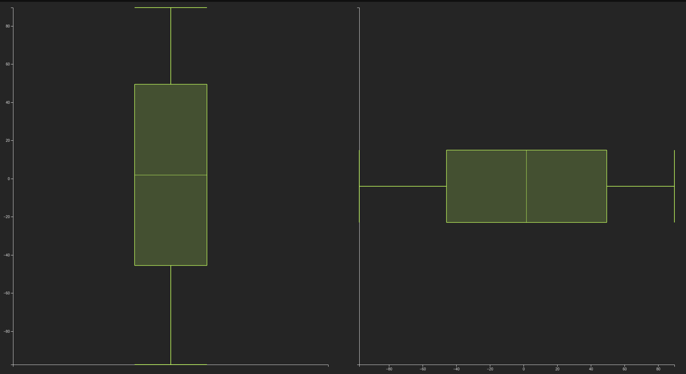

# `Custom <gui-chart /> for boxplot`


## General example of boxplot usage in TS
  ```TS
  const chartEl = document.createElement('gui-chart');
  const boxplot = await greycat.default.call<core.Table>('project::boxplot_float');

  //Vertical Example
  chartEl.setConfig({
    table: { cols: [[]] },
    xAxis: {
      scale: 'linear',
      min: 0,
      max: 10,
      ticks: [],
    },
    yAxes: {
      left: {
        min: boxplot.min,
        max: boxplot.max,
      },
    },
    selection: false,
    cursor: false,
    series: [
      {
        type: 'custom',
        yAxis: 'left',
        yCol: 0,
        hideInTooltip: true,
        draw(ctx, series, xScale, yScale) {
          const boxPlotCanvas: BoxPlotCanvas = {
            max: yScale(boxplot.max),
            median: yScale(boxplot.percentile50),
            min: yScale(boxplot.min),
            q1: yScale(boxplot.percentile25),
            q3: yScale(boxplot.percentile75),
            crossValue: xScale(5),
          };

          const boxPlotOptions: BoxPlotOptions = {
            width: 200,
            iqrColor: series.color,
            whiskerColor: series.color,
            medianColor: series.color,
            orientation: 'vertical',
          };

          ctx.boxPlot(boxPlotCanvas, boxPlotOptions);
        },
      },
    ],
  });
  
  //Horizontal Example
  chartEl.setConfig({
    table: { cols: [[]] },
    series: [
      {
        type: 'custom',
        yAxis: 'left',
        yCol: 0,
        hideInTooltip: true,
        draw(ctx, series, xScale, yScale) {
          const boxPlotCanvas: BoxPlotCanvas = {
            max: xScale(boxplot.max),
            median: xScale(boxplot.percentile50),
            min: xScale(boxplot.min),
            q1: xScale(boxplot.percentile25),
            q3: xScale(boxplot.percentile75),
            crossValue: yScale(5),
          };

          const boxPlotOptions: BoxPlotOptions = {
            width: 200,
            iqrColor: series.color,
            whiskerColor: series.color,
            medianColor: series.color,
            orientation: 'horizontal',
          };

          ctx.boxPlot(boxPlotCanvas, boxPlotOptions);
        },
      },
    ],
    xAxis: {
      scale: 'linear',
      min: boxplot.min,
      max: boxplot.max,
    },
    yAxes: {
      left: {
        min: 0,
        max: 10,
        ticks: [],
      },
    },
    selection: false,
    cursor: false,
  })
  ```

## Recommended way of providing boxplot into custom gui-chart (boxplot) web component

  Use native gcl `HistogramFloat` or `HistogramInt` types. And use instance functions called `add()` or `addWithCount()`
  to accumulate the histogram data into the object. Finally, call `toBoxPlot()` function to get the boxplot object, as shown
  in the below example.

  ```ts
  @expose
  fn boxplot_float(): BoxPlotFloat {
    var histogram = HistogramFloat {};

    var random = Random::new();
    random.setSeed(12345);
    var testSize = 10;

    for (var i = 0; i < testSize; i++) {
      var v = random.uniformf(-100.0, 100.0);
      histogram.add(v);
    }

    return histogram.toBoxPlot();
  }
  ```

## Config

  ```TS
  export interface BoxPlotCanvas {
    median: number;
    q1: number;
    q3: number;
    min: number;
    max: number;
    crossValue: number;
  }

  export interface BoxPlotOptions {
    width: number;
    medianColor: string;
    whiskerColor: string;
    iqrColor: string;
    orientation: 'vertical' | 'horizontal';
  }
  ```
