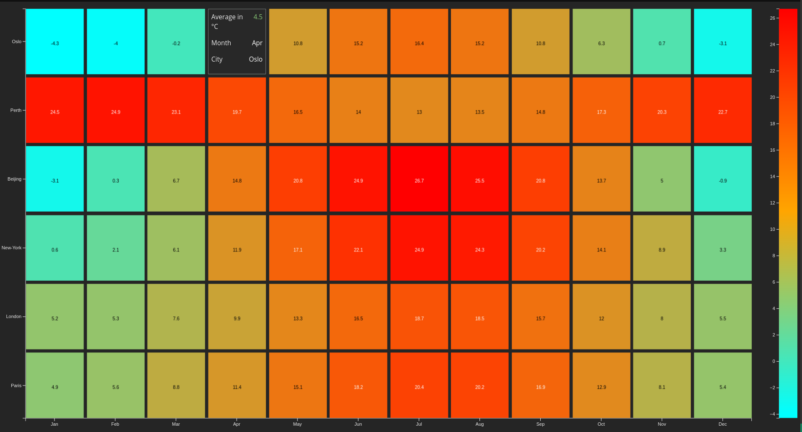

# `<gui-heatmap />`
> Virtualized table component for `gui-heatmap`



## Usage
```ts
// Provide the table from greycat backend
const table = await greycat.default.call<core.Table>('project::heatmap');

const heatmap = document.createElement('gui-heatmap');
heatmap.style.width = '1024px';
heatmap.style.height = '768px';

heatmap.xLabels = ["Jan", "Feb", "Mar", "Apr", "May", "Jun", "Jul", "Aug", "Sep", "Oct", "Nov", "Dec"];
heatmap.yLabels = ["Paris", "London", "New-York", "Beijing", "Perth", "Oslo"];
heatmap.table = table;
heatmap.colorScaleWidth = 50;
```

## Example of a table from the backend
```ts
@expose
fn heatmap() {
  var table = Table::new(12);

  //                           ["Jan", "Feb", "Mar", "Apr", "May", "Jun", "Jul", "Aug", "Sep", "Oct", "Nov", "Dec"];
  var paris = [4.9, 5.6, 8.8, 11.4, 15.1, 18.2, 20.4, 20.2, 16.9, 12.9, 8.1, 5.4];
  var london = [5.2, 5.3, 7.6, 9.9, 13.3, 16.5, 18.7, 18.5, 15.7, 12.0, 8.0, 5.5];
  var newyork = [0.6, 2.1, 6.1, 11.9, 17.1, 22.1, 24.9, 24.3, 20.2, 14.1, 8.9, 3.3];
  var beijing = [-3.1, 0.3, 6.7, 14.8, 20.8, 24.9, 26.7, 25.5, 20.8, 13.7, 5.0, -0.9];
  var perth = [24.5, 24.9, 23.1, 19.7, 16.5, 14.0, 13.0, 13.5, 14.8, 17.3, 20.3, 22.7];
  var oslo = [-4.3, -4.0, -0.2, 4.5, 10.8, 15.2, 16.4, 15.2, 10.8, 6.3, 0.7, -3.1];

  var cities = [paris, london, newyork, beijing, perth, oslo];

  for (row, city in cities) {
    for (col, temp in city) {
      table.set(row, col, temp);
    }
  }

  return table;
}
```

## Properties for the heatmap
```ts
export interface HeatmapProps {
  // Table of the contents
  table: core.Table | null;
  // Naming for the axes. If not set, default is "x", "y", "z"
  axisLabels?: string[];
  // When hovered over the heatmap, you can customise the labels for the tooltip. Default is "x", "y", "z"
  tooltipLabels?: string[];
  // X axis labels for the ticks
  xLabels?: string[];
  // Y axis labels for the ticks
  yLabels?: string[];
  // Linear or Log
  scaleType?: ScaleType;
  // Range for the color scale
  colorScaleRange?: [number, number];
  // Will show "xTicks" number of labels within xLabels
  xTicks?: number;
  // Will show "yTicks" number of labels within yLabels
  yTicks?: number;
  // You can customize the width of the color scale
  colorScaleWidth?: number;
}
```

## Customization
```css
gui-heatmap {
  /** override colorscale colors */
  --color-8: #3b254c;
  --color-9: #779ef7;
  --color-0: #37c43e;
  --color-3: #ffe35b;
  --color-2: #fe7e6d;
  --color-12: #f7458e;

  /* margin variables, can only be pixels */
  --m-top: 10px;
  --m-right: 40px;
  --m-bottom: 25px;
  --m-left: 40px;

  /* color scale margin variables, can only be pixels */
  --colorscale-m-top: 10px;
  --colorscale-m-right: 40px;
  --colorscale-m-bottom: 25px;
  --colorscale-m-left: 40px;
}
```
