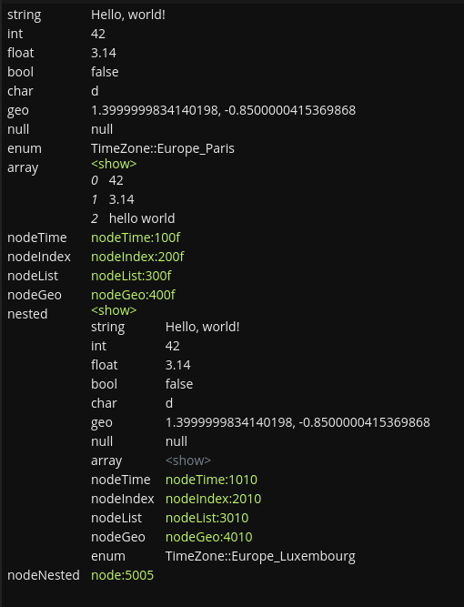

# `<gui-object />`

## Usage
This component can display any complex object instance using a "key-value" representation.

It will, by default, collapse any nested properties (eg. arrays, objects) in a collapsible `<details />`
and only load the nested content when requested.

> This is convenient to quickly dump GreyCat responses and get a feel of the actual response data.

> If the given `value` is a `core::Table`, this component will actually use `<gui-table />` for the display.

## Simple example
::: code-group
```tsx [TSX]
<gui-object value="Hello world!" />
```
```ts [Vanilla]
const object = document.createElement('gui-object');
object.value = 'Hello world!';
```
:::

## Complex example
::: code-group
```tsx [view.tsx]
const result = await greycat.call('project::complex_object');
<gui-object value={result} />
```
```gcl [project.gcl]
type ComplexObject {
  string: String;
  int: int;
  float: float;
  bool: bool;
  char: char;
  geo: geo;
  null: any?;
  enum: TimeZone;
  array: Array;
  nodeTime: nodeTime;
  nodeIndex: nodeIndex;
  nodeList: nodeList;
  nodeGeo: nodeGeo;
  nested: any;
  nodeNested: node<ComplexObject>?;
}

@expose
@write
fn complex_object() {
  return ComplexObject {
    string: "Hello, world!",
    int: 42,
    float: 3.14,
    bool: false,
    char: 'd',
    geo: geo::new(1.4, -0.85),
    null: null,
    enum: TimeZone::Europe_Paris,
    array: [42, 3.14, "hello world"],
    nodeTime: nodeTime::new(),
    nodeIndex: nodeIndex::new(),
    nodeList: nodeList::new(),
    nodeGeo: nodeGeo::new(),
    nested: {
      string: "Hello, world!",
      int: 42,
      float: 3.14,
      bool: false,
      char: 'd',
      geo: geo::new(1.4, -0.85),
      null: null,
      array: [42, 3.14, "hello world"],
      nodeTime: nodeTime::new(),
      nodeIndex: nodeIndex::new(),
      nodeList: nodeList::new(),
      nodeGeo: nodeGeo::new(),
      enum: TimeZone::Europe_Luxembourg,
    },
    nodeNested: node<ComplexObject>::new(ComplexObject {
        string: "Nested Hello, world!",
        int: 1337,
        float: 3.1415,
        bool: true,
        char: 'g',
        geo: geo::max,
        null: null,
        enum: TimeZone::Asia_Tokyo,
        array: [1337, 3.1415, "GreyCat"],
        nodeTime: nodeTime::new(),
        nodeIndex: nodeIndex::new(),
        nodeList: nodeList::new(),
        nodeGeo: nodeGeo::new(),
        nested: [],
      }),
  };
}
```
:::

The resulting view will look like:

