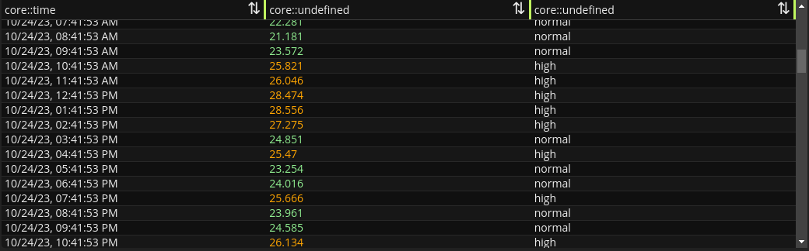

# `<gui-table />`
> Virtualized table component for [`core::Table`](/libs/std/core/type.Table.html)



## Usage

```ts
const table = document.createElement('gui-table');
table.table = await fetchTable();
```

Under-the-hood, `<gui-table />` uses `<gui-value />` to render cells. You can change the properties passed to `<gui-value />` by setting [cellProps](#override-cell-properties).

## Events
| Name               | Detail                  | Description                            |
| ------------------ | ----------------------- | -------------------------------------- |
| `'table-click'`    | `TableClickEventDetail` | Triggered when a row is clicked        |
| `'table-dblclick'` | `TableClickEventDetail` | Triggered when a row is double-clicked |

### TableClickEventDetail
```ts
export type TableClickEventDetail = {
  /**
   * The current row index. This is not necessarily the "original" row index.
   * If the table is filtered or sorted, it is the "current" row index.
   *
   * To know the "original" index, check the property `originalIndex` in the `row` values.
   */
  rowIdx: number;
  /**
   * Current column index.
   */
  colIdx: number;
  /**
   * The associated row values.
   */
  row: Value[];
};
```

### Value
```ts
type Value = {
  /** The actual value for the cell */
  value: unknown;
  /**
   * The original index of the row in the column.
   * 
   * This is required because sorting/filtering changes indexing.
   */
  originalIndex: number;
};
```

## Override cell properties
```ts
/**
 * A function called to compute the cell properties
 * that will be passed to the underlying `<gui-value />` component.
 */
export type CellProps = (
  row: Value[],
  value: unknown,
  rowIdx: number,
  colIdx: number,
) => ValueProps & { value: unknown };

type ValueProps =
  Omit<utils.StringifyProps, 'value' | 'dateFmt' | 'numFmt'>
  & Partial<Pick<GuiValueProps, 'linkify' | 'onClick'>>;
```
> See [GuiValueProps](../value/index.md#valueprops) for more information.